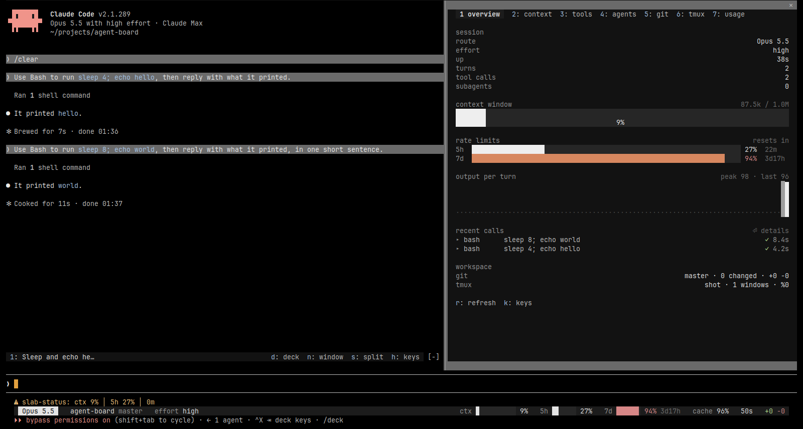

# slab-deck

A control center for [Claude Code](https://claude.com/claude-code) in the SLAB design language: dark
surfaces, hue only on glyphs and outcome markers (`› ▸ ✓ ✗ ! · ↳ ▪`), no box drawing.
Two parts that work together:

- `statusline-slab.sh` fills Claude Code's own status line slot with gauges in true colour.
- `mod/slab-deck` is a mod on the function-hooks plugin API (Claude Code 2.1.289+): a live band above
  the prompt, a docked deck pane, popups and tmux navigation.


## What it shows

**Statusline** (Claude Code's status line slot): model, repo and branch, effort | context, 5h and 7d
rate-limit gauges (amber from 70 %, red from 90 %, reset countdown once a window passes 70 %), prompt-cache
hit rate, output-per-turn sparkline (handed over by the mod), session clock, lines `+N −N`. Facts drop by
priority when the terminal narrows; a window at 70 % or more outlasts the repo name.

**Band above the prompt**: while a turn runs, the animated ▪▪▪ working indicator with elapsed time, step,
tokens, tok/s and the tools running; when idle, your tmux windows as links (`1`–`9`) and actions
(`d` deck, `n` window, `s` split, `h` keys).

**Deck pane** — `/deck [section]`

| section | contents |
| --- | --- |
| overview | session facts, context, rate limits and resets, output per turn, recent tool calls |
| context | the `/context` grid, categories, autocompact mark, memory files |
| tools | calls by tool, 30-minute timeline, recent calls |
| agents | subagents and their status |
| git | changed files with diff bars, commits, history graph in a new tmux window |
| tmux | all panes of the session: live peek, window minimap, go there, new window, split, zoom |
| usage | rate limits, token totals, cache hit, turn durations |
| providers | every subscription / provider account and model route you feed it: used, left, balance, resets (see below) |

**Popups** for a tool call, a turn, a tmux pane and the key list (`esc` closes).

**Animations**: the ▪▪▪ indicator breathes while a turn runs; the deck's context and rate-limit gauges sweep
up when it opens and glide to each new value. Both repaint cells in place (`$.ui.blit`), no redraw.
`P1_REDUCED_MOTION=1` or `SLAB_REDUCED_MOTION=1` freezes them.

Also `/deck-band full|compact|off` and toasts when context or a rate limit crosses 80 %.
The tmux actions only select, open or split; nothing closes, kills or types into another pane.



## Install

```sh
git clone https://github.com/5omeOtherGuy/slab-deck
claude --plugin-dir slab-deck/mod/slab-deck
```

For every session, in `~/.claude/settings.json`:

```json
"env": { "CLAUDE_CODE_PLUGIN_DIRS": "/path/to/slab-deck/mod/slab-deck" },
"statusLine": { "type": "command", "command": "/path/to/slab-deck/statusline-slab.sh", "padding": 0, "refreshInterval": 2 }
```

The statusline needs `jq` and `git`, and works without the mod (no sparkline then). `refreshInterval`
re-fits it after a resize and keeps its clock and countdowns current; one run takes about 60 ms.

tmux and git features turn on by themselves when Claude Code runs inside tmux or a git repository.
`P1_REDUCED_MOTION=1` or `SLAB_REDUCED_MOTION=1` freezes the working indicator.

## Providers tab

The `providers` tab draws whatever your own command reports, so account names, keys and endpoints never live
in this mod. It runs `providersCommand` (default `provider-usage` on `PATH`; argv split on spaces, no shell)
when the tab opens and the last reading is over 2 minutes old, every 5 minutes, and on `r`. Set it in
`~/.claude/settings.json`:

```json
"pluginConfigs": { "slab-deck": { "options": { "providersCommand": "/path/to/my-usage --json" } } }
```

The command prints one JSON document; unknown values are `null`, never 0:

```ts
{
  ts: string, proxy: string,                        // when read; one free line of route/proxy state
  accounts: { label, provider, source: string,
              windows: { name: string, pct: number|null, resetsAt: string|null /* ISO */, resetsLocal: string|null,
                         value: number|null, unit: string|null /* a balance */, status: string|null }[],
              facts: [string, string][],             // plan, credits, extra usage …
              state: 'ok'|'stale'|'error'|'none', note: string|null, ageS: number|null }[],
  routes:   { model: string, agents: string[],
              pool: { route: string, account: string|null, state: 'ready'|'cold'|'skipped'|'unmetered'|'unread',
                      usedPct: number|null, resetsAt: string|null, resetsLocal: string|null,
                      balance: string|null, requests: number }[] }[]   // pool in failover order
}
```

A failed read keeps the last snapshot on screen and names the error.

## Develop

```sh
claude plugin validate mod/slab-deck
claude plugin test mod/slab-deck
```

| file | role |
| --- | --- |
| `hooks/register.tsx` | events, timers, commands, every `$` call (the engine follows `$` only within one file) |
| `hooks/views.tsx` | band, deck sections and popups |
| `hooks/ink.ts` | design tokens and the Raster painters (gauges, charts, minimap, working indicator) |
| `hooks/data.ts` | git and tmux output parsers |
| `types/index.d.ts` | the `$.state` contract |

## License

MIT
